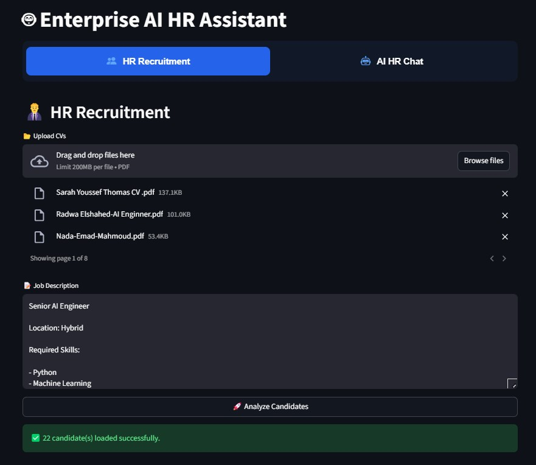
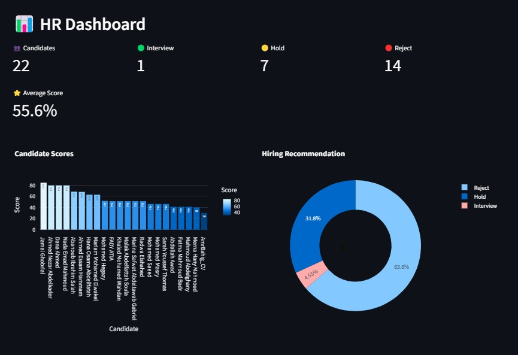
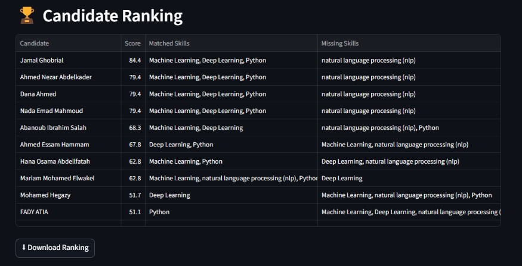
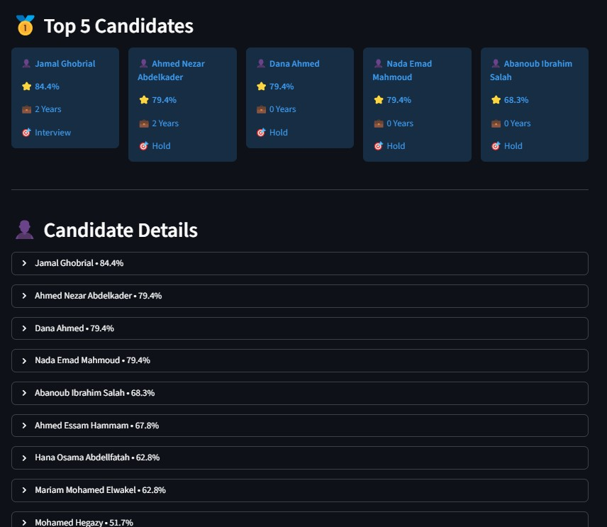
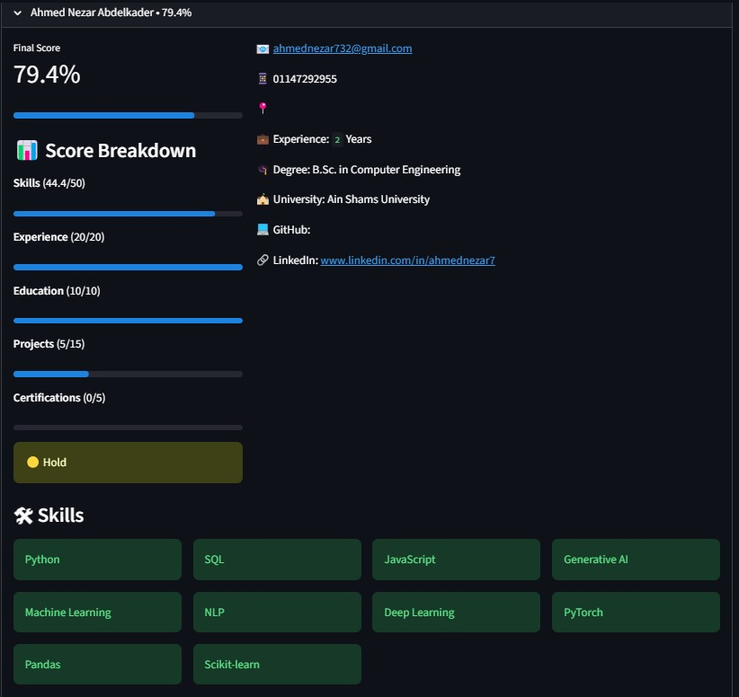
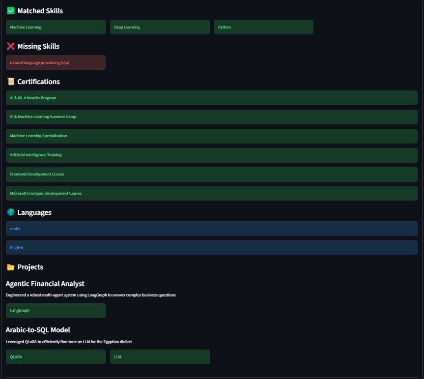
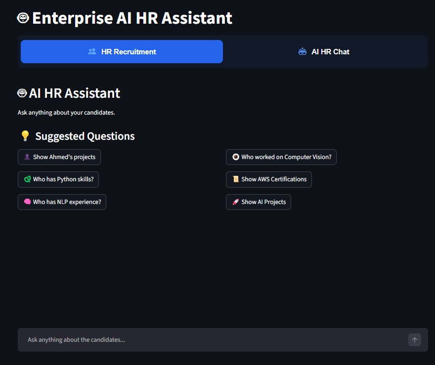

# 🤖 Enterprise AI HR Recruitment Assistant

An AI-powered recruitment platform that automates candidate screening, ranking, evaluation, and HR question answering using **Large Language Models (LLMs)** and **Retrieval-Augmented Generation (RAG)**.

---

## 📷 Home Page

> <p align="center">
  <p align="center">
    
</p>

 (Application Header + CV Upload + Job Description + Analyze Candidates Button)

---

# 📖 Overview

Recruiters often spend hours reviewing hundreds of CVs manually.

This project automates the recruitment process by allowing HR teams to:

- Upload multiple candidate CVs.
- Analyze Job Descriptions automatically.
- Extract structured candidate information using LLMs.
- Rank candidates using an explainable scoring engine.
- Generate AI-powered hiring evaluations.
- Ask natural language questions about candidates using a RAG-based chatbot.

Instead of manually reviewing resumes, recruiters receive an explainable and transparent hiring recommendation within seconds.

---

# ✨ Features

## 📄 CV Processing

- Upload multiple PDF resumes
- Automatic CV parsing using LLMs
- Candidate profile extraction
- Skills extraction
- Experience extraction
- Education extraction
- Projects extraction
- Certification extraction

---

## 💼 Job Description Analysis

The system automatically analyzes the Job Description and extracts:

- Required Skills
- Minimum Experience
- Education Requirements
- Certifications

---

## 🎯 Candidate Ranking Engine

Candidates are evaluated using a weighted scoring system.

| Category | Weight |
|----------|--------|
| Skills | 50% |
| Experience | 20% |
| Education | 10% |
| Projects | 15% |
| Certifications | 5% |

Each candidate receives:

- Final Score
- Matched Skills
- Missing Skills
- Hiring Recommendation

---

## 📊 Explainable AI

Instead of returning only a score, the system explains:

- Why the candidate received this score
- Matched Skills
- Missing Skills
- Score Breakdown
- Recommendation

---

## 📷 HR Dashboard

> 📌 <p align="center">
    
</p>
>
> (Dashboard Metrics + Charts)

The dashboard includes:

- Candidate Statistics
- Hiring Recommendation Distribution
- Candidate Ranking
- Interactive Charts
- CSV Export

---

## 👤 Candidate Details

Each candidate profile contains:

- Personal Information
- Experience
- Education
- Skills
- Certifications
- Projects
- Score Breakdown
- Recommendation

---

## 📷 Candidate Details

> 📌 <p align="center">
    
</p>
<p align="center">
    
</p>

<p align="center">
    
</p>
<p align="center">
    
</p>
>
> (Score Breakdown + Skills + Projects)

---

# 🤖 AI Candidate Evaluation

The recruiter can request an AI evaluation for every candidate.

The LLM generates:

- Overall Assessment
- Technical Fit
- Score Explanation
- Strengths
- Weaknesses
- Interview Questions
- Final Recommendation

This combines deterministic scoring with LLM reasoning.

---

# 🧠 Enterprise AI HR Chat (RAG)

The application provides an AI HR Assistant capable of answering recruiter questions directly from uploaded CVs.

Example Questions:

- Which candidate has the strongest Machine Learning background?
- Compare candidates with FastAPI experience.
- Who has AWS certification?
- Which candidate worked on RAG projects?
- Which candidate has Computer Vision experience?

The assistant answers **only using retrieved information from the uploaded resumes.**

---

## 📷 AI HR Chat

>📌  <p align="center">
    
</p>
> (Question + Answer + Sources)

---

# 🔍 RAG Pipeline

The chatbot follows a Retrieval-Augmented Generation pipeline.

```
PDF Files
      │
      ▼
Document Loader
      │
      ▼
Recursive Chunking
      │
      ▼
HuggingFace Embeddings
      │
      ▼
Chroma Vector Database
      │
      ▼
Hybrid Retrieval
(Semantic + BM25)
      │
      ▼
Context Construction
      │
      ▼
Llama 3.3 (Groq)
      │
      ▼
Grounded Answer
      │
      ▼
Sources
```

---

# 🔎 Hybrid Search

To improve retrieval quality, the project combines two retrieval methods.

### Semantic Search

Uses HuggingFace embeddings stored inside ChromaDB to retrieve semantically similar CV chunks.

### Keyword Search

Uses BM25 retrieval to capture exact keyword matches.

The final retrieved context is a combination of both approaches.

---

# 📂 Chunking Strategy

Current implementation:

- Recursive Character Text Splitter

Configuration:

- Chunk Size: **1000**
- Chunk Overlap: **200**

This preserves context while reducing information loss.

---

# ⚡ LLM Caching

To reduce latency and API costs, the project caches LLM responses.

Cached operations include:

- Candidate Profile Extraction
- AI Candidate Evaluation

Benefits:

- Faster execution
- Lower API cost
- Reduced token consumption

---

# 🏗️ Project Architecture

```
Upload CVs
        │
        ▼
PDF Loader
        │
        ▼
LLM Candidate Extraction
        │
        ▼
Job Description Parsing
        │
        ▼
Semantic Skill Matching
        │
        ▼
Weighted Scoring Engine
        │
        ▼
Candidate Ranking
        │
        ├────────► HR Dashboard
        │
        ├────────► AI Evaluation
        │
        ▼
RAG Knowledge Base
        │
        ▼
Enterprise HR Chat Assistant
```

---

# 🛠 Technology Stack

- Python
- Streamlit
- LangChain
- Groq API
- Llama 3.3
- ChromaDB
- HuggingFace Embeddings
- BM25 Retrieval
- Plotly
- Pandas

---

# 📁 Project Structure

```
CV-RAG-Hiring-Assistant
│
├── app.py
├── rag/
├── utils/
├── cache/
├── data/
|──
├── requirements.txt
├── README.md
└── .env.example
```

---

# 🚀 Installation

Clone the repository

```bash
git clone https://github.com/your-username/CV-RAG-Hiring-Assistant.git
```

Install dependencies

```bash
pip install -r requirements.txt
```

Create `.env`

```text
GROQ_API_KEY=YOUR_API_KEY
```

Run the application

```bash
streamlit run app.py
```

---

# 🚀 Future Improvements

- Cross-Encoder Re-ranking
- Adaptive RAG
- Multi-Query Retrieval
- Document-Aware Chunking
- ATS Integration
- Authentication & Authorization
- Cloud Deployment (AWS / Azure)
- Email Integration
- Interview Scheduling
- Candidate Database

---

# 👨‍💻 Author

**Ebraam Nabil**

AI Engineer
